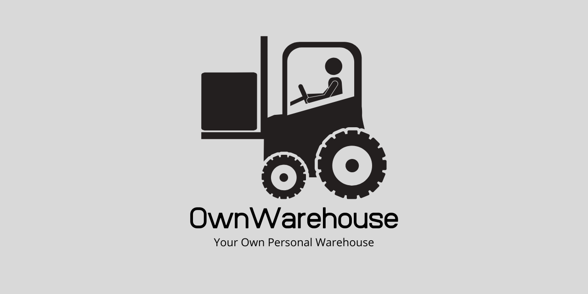

# OwnWarehouse
> OwnWarehouse aims to be a free, open-source and lightweight solution to store and organize your belonglings at home.

## Current Features
- Fancy GUI
- Search for items
- Filter items
- History of Items
- Automatic location-algorithm

## Roadmap
If you have an idea for a new feature, then you are welcome to open a new **feature request**. Thank you!
- Algorithm thread based → better scalability with lots of tons of data
- Image upload for items
- Reports of the data with fancy charts

## Contributing
Pull requests are welcome. For major changes, please open an issue first to discuss what you would like to change.

Please take a look at the [contributing guidelines](https://github.com/ntec-io/OwnWarehouse/blob/master/CONTRIBUTING.md) 
and the [Code of Conduct](https://github.com/ntec-io/OwnWarehouse/blob/master/CODE_OF_CONDUCT.md).

## License
[GNU GPLv3](https://choosealicense.com/licenses/gpl-3.0/) or got to [LICENSE](https://github.com/ntec-io/OwnWarehouse/blob/master/LICENSE)

## Credits and licensing
Special thanks go to these fantastic libraries/frameworks/tools:
- [Java](https://www.java.com/) *as the language which this application is written in*
- [Gradle](https://gradle.org/) *as the build tool*
- [MySQL](https://www.mysql.com) *for its database and connector*
- [Hibernate](https://hibernate.org/) *as the data-persistence-framework*
- [ControlsFX](https://github.com/controlsfx/controlsfx) *for its CheckComboBox*